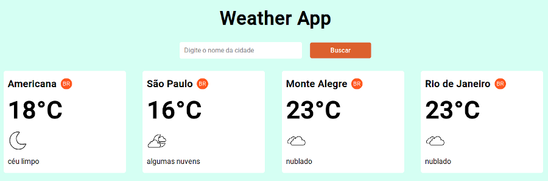

<div align="center">

</div>
</br>

# Weather App

# Tecnologias usadas
* React
* styled-components
* axios

# Instalação
Você precisa instalar o [Nodejs](https://nodejs.org/en/download/) e o [Yarn](https://yarnpkg.com/) e após isso executar o seguinte comando:
```
git clone https://github.com/paulojrr/Weather-App.git
```

# Dependências
```
yarn install
```
ou
```
npm install
```

# Start da aplicação
```
yarn start
```


